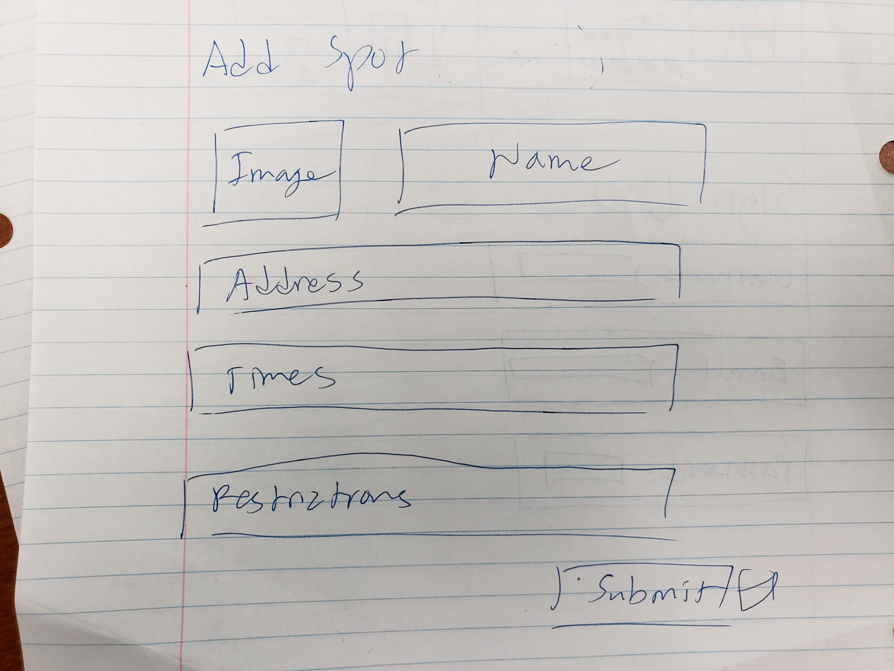

## Table of Contents
* [Overview](#overview)
* [User Guide](#user-guide)
* [Community Feedback](#community-feedback)
* [Developer Guide](#developer-guide)
* [Development History](#development-history)
* [Walkthrough videos](#walkthrough-videos)
* [Example enhancements](#example-enhancements)

## Overview

Beyond the Library is a web application for students to post and rate study spots throughout the UH Manoa campus and the surrounding areas so that other students become aware of possible study spots.

## User Guide

### Landing Page

### User Profile Page

### Sign Up Page

### Sign In Page

### Add Study Spot Page

### Discover New Study Spots Page

### Community Feedback

(Apologies, this is still under construction. Mahalo for your understanding)

## Developer Guide

(Apologies, this is still under construction. Mahalo for your understanding)

### Installation

(Apologies, this is still under construction. Mahalo for your understanding)

### Application Design

(Apologies, this is still under construction. Mahalo for your understanding)

## Development History

(Apologies, this is still under construction. Mahalo for your understanding)

## Walkthrough videos

(Apologies, this is still under construction. Mahalo for your understanding)

## Example enhancements

(Apologies, this is still under construction. Mahalo for your understanding)
