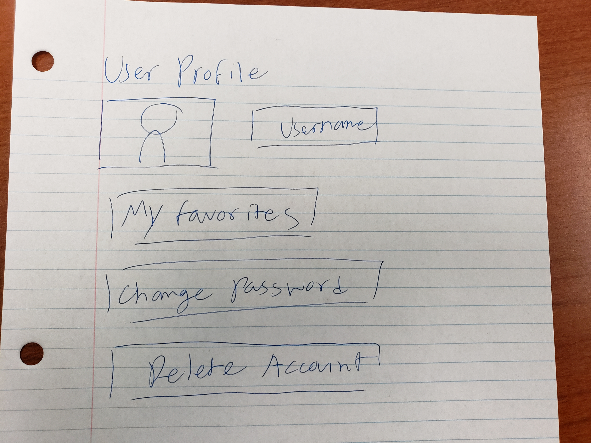
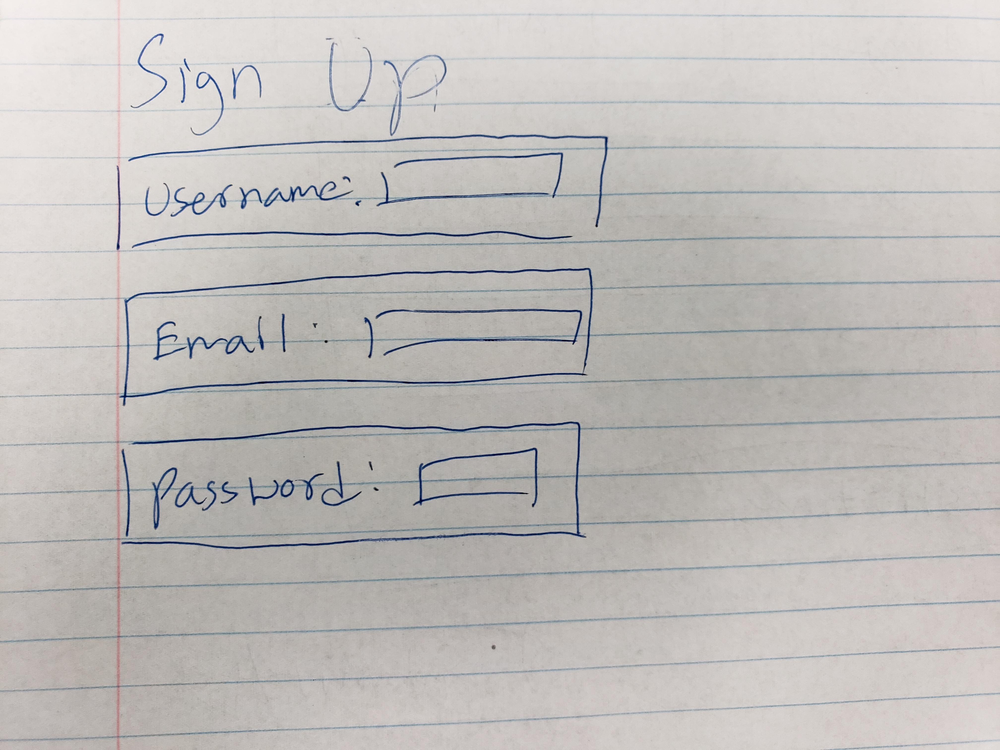
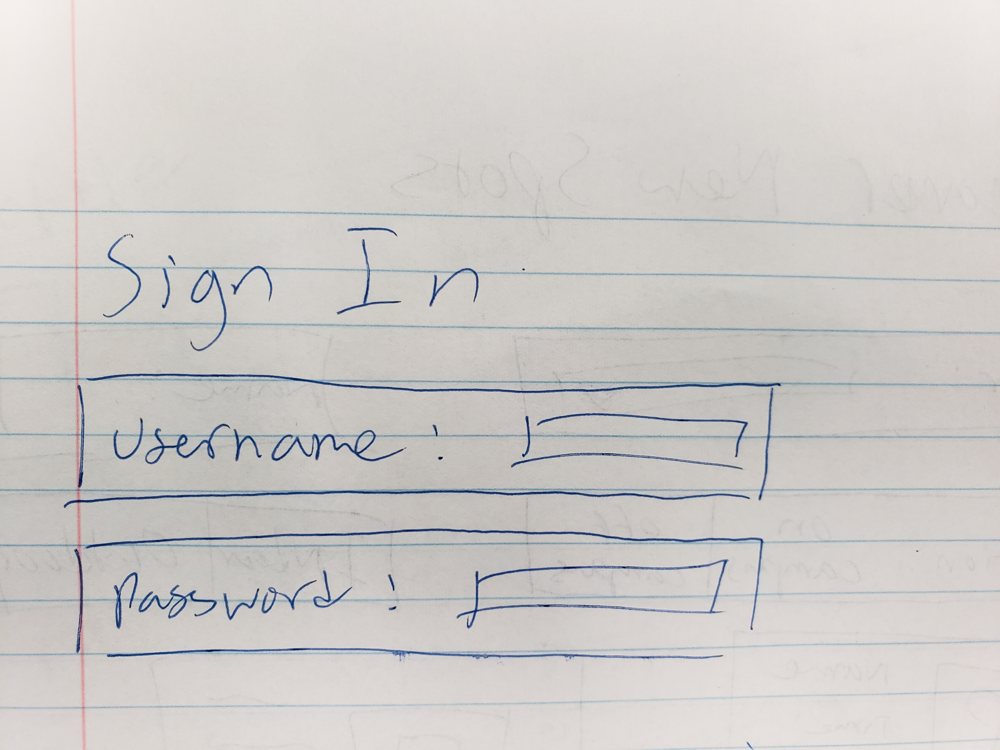
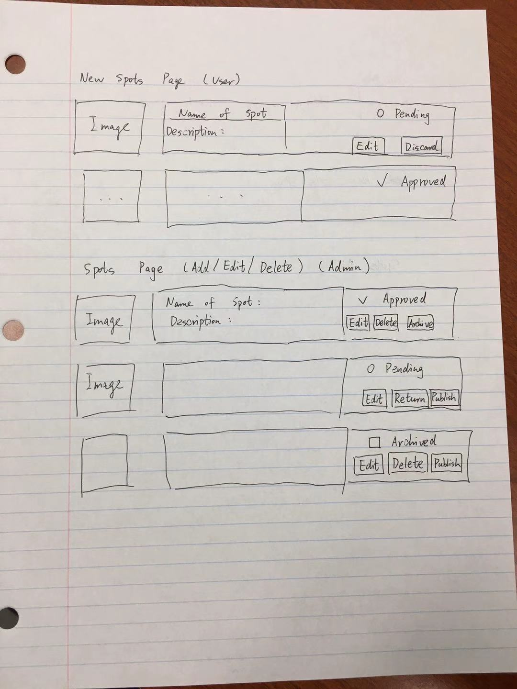
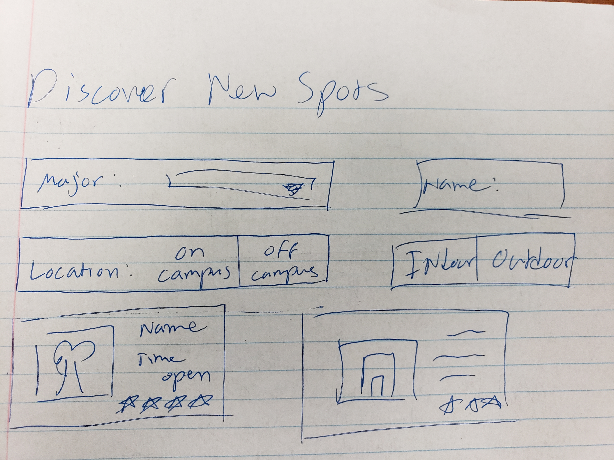

# Table of Contents

* [Project Goal](#project-goal)
* [Team Goals](#team-goals)
* [User Guide](#user-guide)
* [Final System Goals](#final-system-goals)
* [Community Feedback](#community-feedback)
* [Developer Guide](#developer-guide)
* [Development History](#development-history)
* [Walkthrough videos](#walkthrough-videos)
* [Example enhancements](#example-enhancements)

## Project Goal

Beyond the Library is a web application for students to post and rate study spots throughout the UH Manoa campus and the surrounding areas so that other students become aware of possible study spots. This is to inform UH students that there are other locations beside the library to study (hence the name). Each entry will list hours, capabilities, capacity of the location, and accessibility to different types of students. In addition, there is a “real-time” feature, where students can login and provide time-stamped notifications about the current state of the study space.

## Team Goals

These are the goals set forth by the team to improve skills in regards to software engineering.

### Soft Skills

* Working together in a team

### Technical Skills

Become better aquatinted with:

* Database (MongoDB)
* Background processing
* Semantic  UI & React
* Galaxy (deployment of a full website)

## Final System Goals

The final version of Beyond the Library should be able to fulfill the following:

* Landing page for users not signed in or signed up. Provides links to guides that show how to sign up and navigate the site.
* User profile page where a user can customize his or her personal information, change password, and delete account.
* Sign up page where non-registered users can create an account.
* Sign in page where registered users can log into their account.
* Add study spot page where users can suggest adding a new study location not presently listed in Beyond the Library. Admin will be responsible for approving and adding the location on the admin version of the page.
* Discover new study spots page where users can find new places to study by filtering locations by indoors/outdoors, times open, on/off campus, etc.

## User Guide

Examples of pages in the Beyond the Library web application.

### Landing Page

### User Profile Page

### Sign Up Page

### Sign In Page

### Add Study Spot Page

### Discover New Study Spots Page

### Community Feedback

(Apologies, this is still under construction. Mahalo for your understanding)

## Developer Guide

(Apologies, this is still under construction. Mahalo for your understanding)

### Installation

(Apologies, this is still under construction. Mahalo for your understanding)

### Application Design

(Apologies, this is still under construction. Mahalo for your understanding)

## Development History

(Apologies, this is still under construction. Mahalo for your understanding)

## Walkthrough videos

(Apologies, this is still under construction. Mahalo for your understanding)

## Example enhancements

(Apologies, this is still under construction. Mahalo for your understanding)
