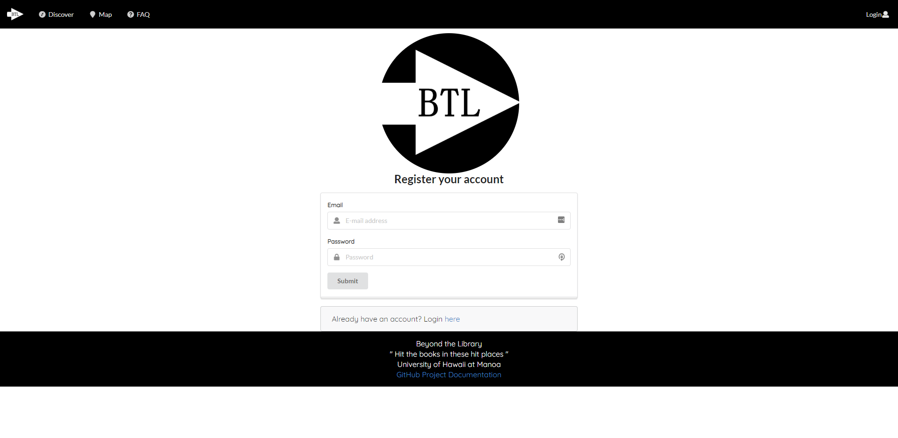

## Quick Access
* [Current Live Version of Beyond the Library](https://beyond-the-library.meteorapp.com)
* [Beyond the Library Organization Page](https://github.com/beyond-the-library)
* [Documentation Repository](https://github.com/beyond-the-library/beyond-the-library.github.io)
* [Code Repository](https://github.com/beyond-the-library/beyond-the-library)
* [Project Milestone 1](https://github.com/beyond-the-library/beyond-the-library/projects/3)
* [Project Milestone 2](https://github.com/beyond-the-library/beyond-the-library/projects/2)

## Table of Contents
* [Overview](#overview)
* [User Guide](#user-guide)

## Overview

Beyond the Library is a web application for students to post and rate study spots throughout the UH Manoa campus and the surrounding areas so that other students become aware of possible study spots. This is to inform UH students that there are other locations beside the library to study (hence the name). Each entry will list hours, capabilities, capacity of the location, and accessibility to different types of students. In addition, there is a “real-time” feature, where students can login and provide time-stamped notifications about the current state of the study space.

## User Guide

Examples of pages in the Beyond the Library web application.

### Landing Page

[I'm alive, click me to visit the page you see above!](http://beyond-the-library.meteorapp.com/#/)

The landing page is created with the idea that users shouldn't have to scroll around a page to figure out what the
 page/website is all about. We provide information about the site and how/why users should create an account. 

### User Profile Page

[I'm alive, click me to visit the page you see above!](http://beyond-the-library.meteorapp.com/#/userprofile)

The User Profile page is meant to highlight the users favorite spots and allows an easy way to customize their account.

### Sign Up Page

[I'm alive, click me to visit the page you see above!](http://beyond-the-library.meteorapp.com/#/signup)

The sign up page allows people to register for an account.

### Sign In Page

[I'm alive, click me to visit the page you see above!](http://beyond-the-library.meteorapp.com/#/signin)

The sign in page allows users to log into their account. Certain features, such as adding a study spot requires the
 user to be logged in.

### Add Study Spot Page

[I'm alive, click me to visit the page you see above!](http://beyond-the-library.meteorapp.com/#/myspots)

[I'm alive, click me to visit the page you see above!](http://beyond-the-library.meteorapp.com/#/admin)

Users can see all the spots they posted to the admin user on myspots page. Users cannot directly publish a spot; the admin user can edit and publish spots on the admin allspots page.

### Discover New Study Spots Page

[I'm alive, click me to visit the page you see above!](http://beyond-the-library.meteorapp.com/#/discovery)

Users can filter study spots based on various parameters such as major restriction.

## Developer Guide

(Apologies, this is still under construction. Mahalo for your understanding)

## Team Members

* [Christopher's Professional Portfolio](https://chriswon98.github.io/)  
* [Yuhan's Professional Portfolio](https://yuhanj.github.io/)
* [Aljaed's Professional Portfolio](https://aljereno.github.io/)    
* [Andrew's Professional Portfolio](https://asalazar46.github.io/)  
