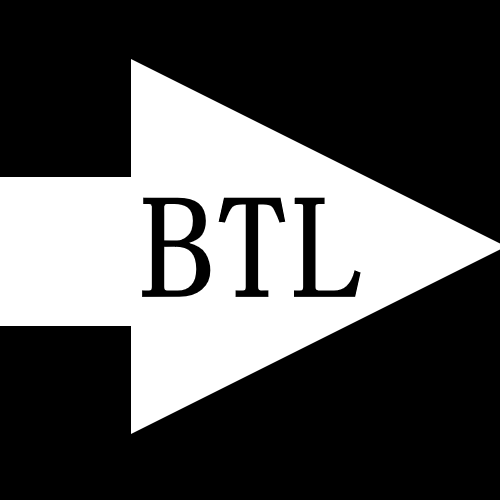
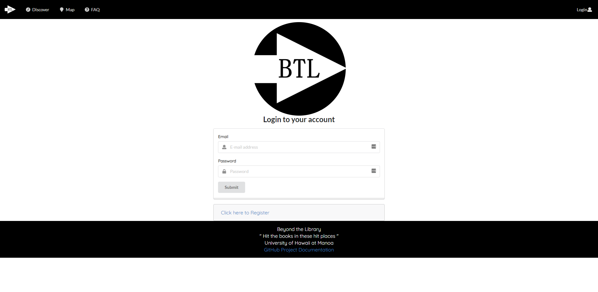
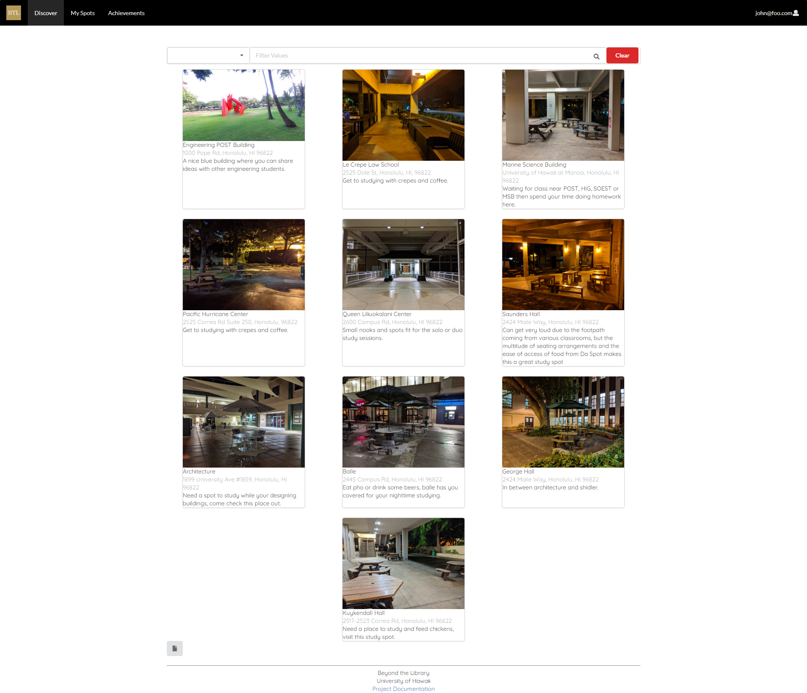
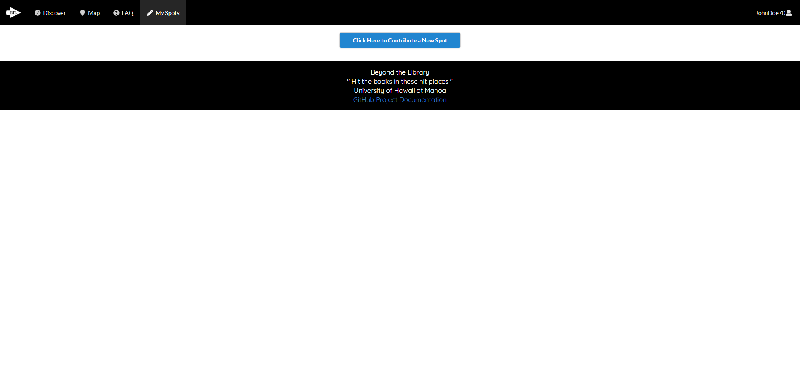

<a href='https://beyond-the-library.meteorapp.com'>
    
</a>


## Quick Access

* [Current Live Version of Beyond the Library](https://beyond-the-library.meteorapp.com)
* [Beyond the Library Organization Page](https://github.com/beyond-the-library)
* [Documentation Repository](https://github.com/beyond-the-library/beyond-the-library.github.io)
* [Code Repository](https://github.com/beyond-the-library/beyond-the-library)
* [Project Milestone 1](https://github.com/beyond-the-library/beyond-the-library/projects/3)
* [Project Milestone 2](https://github.com/beyond-the-library/beyond-the-library/projects/2)
* [Project Milestone 3](https://github.com/beyond-the-library/beyond-the-library/projects/4)

## Table of Contents

* [Overview](#overview)
* [User Guide](#user-guide)
* [Developer Guide](#developer-guide)
* [Community Feedback](#community-feedback)
* [Team Members](#team-members)

## Overview

Currently, there is no dedicated website for study spots for UH students! Well that was the case until now. Beyond the
 Library is a web application for UH students to discover and share study spots both on the UH campus grounds and the
  surrounding areas. This is to encourage UH students to go **beyond the library** when it comes to sitting down and
   studying (hence the name). 
  
### Special Sauce

The "special sauce" of Beyond the Library is the integration of a map to the study spot cards. This allows user to
 easily determine the location of a study spot as well as other study spots nearby. Users can also share these
  thoughts by posting comments on the study spot cards.

## User Guide

The following are example snapshots of the pages found in Beyond The Library. 
* Pages denoted with **(User)** indicate that you must be logged into an account to view the page. 
* Pages denoted with **(Admin)** indicate that you must be logged into an administrator account to view the page.

### Landing Page

The Landing Page is a simple page the user will first see when they visit the site. The objective of the site is
 stated plainly to "discover new study spots!". We also suggest to the user that they log in or sign up before
  proceeding. If the user is still lost on what to do next, they are encouraged to visit the Frequently Asked Questions
   (FAQ) page in the navigation menu.
 

[Live Version of Landing Page](http://beyond-the-library.meteorapp.com/#/)

### (User) Landing Page

By registering or logging in, the user now can now see the "My Spots" tab in the navigation menu.


[Live Version of Landing Page](http://beyond-the-library.meteorapp.com/#/)

### (Admin) Landing Page

By logging in with the admin account, the user can now see the "All Spots" tab in the navigation menu.


[Live Version of Landing Page](http://beyond-the-library.meteorapp.com/#/)

### Sign Up Page

The sign up page allows a member of the UH community to create a new account.


[Live Version of Sign Up Page](http://beyond-the-library.meteorapp.com/#/signup)

### Sign In Page

The sign in page allows a person with an account to log in and access the features available only to logged in users.


[Live Version of Sign In Page](http://beyond-the-library.meteorapp.com/#/signin)

### FAQ Page

The FAQ Page allows the user to read explanations/instructions to common questions regarding using Beyond the Library.


[Live Version of FAQ Page](http://beyond-the-library.meteorapp.com/#/FAQ)

### Discover Page

On the Discover Page, the user can filter study spots by certain criteria (i.e. all study spots that are outdoors
) using the dropdown menu options. Pressing the "clear" button will reset the filter and show all study spots
. Below each study spot card are comments posted by logged in users.
 

[Live Version of Discover Page](http://beyond-the-library.meteorapp.com/#/discovery)
 
 When the user clicks on one of the study spot cards, a map is brought up with the study spot marked on the map with
  a blue pointer. The study spot card is then placed to the right of the map.
  

[Live Version of Specific Study Spot](http://beyond-the-library.meteorapp.com/#/location/6EhuFewQhtga6S9q7)

### (User) Discover Study Spots

When the user is logged into his/her account the Discover Page operates similarly with the added feature of being
 able to add their own comments.
 

[Live Version of Discover Page](http://beyond-the-library.meteorapp.com/#/discovery)
 
### (User) My Spots Page

The user's submitted study spots are shown here if the user has any. There is also a button that the user presses to
 get to the new study spot submission form.
 

[Live Version of My Spots Page](http://beyond-the-library.meteorapp.com/#/myspots)

The user fills out the relevant information to add a spot. If the user is lost, by hovering their mouse over the
 blank field will show a pop up of what should be entered into the field.
 

[Live Version of My Spots Page](http://beyond-the-library.meteorapp.com/#/addspot)

### Map Page

The Map Page displays all the published locations on the map. Clicking on one of the blue location markers will bring
 up the study spot card to the right of the map. Clicking on the study card spot that pops up will take the user to a
  map showing just that location on the map.
 

[Live Version of Map Page](http://beyond-the-library.meteorapp.com/#/locations)

### All Spots Page

The admin can view all study spots regardless if it is classified as "published". It is the admin's duty to review
 and manage all study spots on Beyond the Library. There are 4 classifications:
 * "Archived" are study spots that may no longer be accessible or is currently undergoing renovations.
 * "Rejected" are study spots that are missing information or are not legitimate study spots (i.e. user suggest
  middle of Dole St.).
 * "Pending" are study spots awaiting admin review and approval.
 * "Published" are study spots that are approved study spots and visible to all users.
   

[Live Version of All Spots Page](http://beyond-the-library.meteorapp.com/#/admin)

## Developer Guide

### Installation

1. Install <a href="https://www.meteor.com/install">Meteor</a>.
2. Clone <a href="https://github.com/beyond-the-library/beyond-the-library">Beyond the Library</a> to your local
 machine.
3. Navigate to the app/ directory in your local copy of Beyond the Library.
4. Run the following command to install the necessary libraries. _These are located in the "package.json"._ 
    ```
    meteor npm install
    ```
   
5. Run the application with the following command:
    ```
    meteor npm run start
    ```
   
6. Running the app for the first time should produce a similar output as shown below:
    ```
   D:\User\Documents\GitHub\beyond-the-library\app>meteor npm run start
   
   > meteor-application-template-react@ start D:\User\Documents\GitHub\beyond-the-library\app
   > meteor --no-release-check --settings ../config/settings.development.json
   
   [[[[[ ~\D\User\Documents\GitHub\beyond-the-library\app ]]]]]
   
   => Started proxy.
   => Started MongoDB.
   W20191217-19:02:08.164(-10)? (STDERR) Note: you are using a pure-JavaScript implementation of bcrypt.
   W20191217-19:02:08.246(-10)? (STDERR) While this implementation will work correctly, it is known to be
   W20191217-19:02:08.248(-10)? (STDERR) approximately three times slower than the native implementation.
   W20191217-19:02:08.249(-10)? (STDERR) In order to use the native implementation instead, run
   W20191217-19:02:08.250(-10)? (STDERR) 
   W20191217-19:02:08.251(-10)? (STDERR)   meteor npm install --save bcrypt
   W20191217-19:02:08.254(-10)? (STDERR) 
   W20191217-19:02:08.255(-10)? (STDERR) in the root directory of your application.
   I20191217-19:02:08.682(-10)? Creating the default user(s)
   I20191217-19:02:08.683(-10)?   Creating user admin@foo.com with image https://moonvillageassociation.org/wp-content/uploads/2018/06/default-profile-picture1.jpg and favorite spot: undefined
   I20191217-19:02:09.028(-10)?   Creating user john@foo.com with image https://moonvillageassociation.org/wp-content/uploads/2018/06/default-profile-picture1.jpg and favorite spot: undefined
   I20191217-19:02:09.333(-10)?   Creating user aljtest@foo.com with image https://moonvillageassociation.org/wp-content/uploads/2018/06/default-profile-picture1.jpg and favorite spot: undefined
   I20191217-19:02:09.545(-10)?   Creating user chris@hawaii.edu with image https://moonvillageassociation.org/wp-content/uploads/2018/06/default-profile-picture1.jpg and favorite spot: undefined
   I20191217-19:02:09.850(-10)? Creating default spots.
   I20191217-19:02:09.852(-10)?   Adding: Paradise Palms (Renovated) (john@foo.com)
   I20191217-19:02:09.882(-10)?   Adding: Engineering POST Building (admin@foo.com)
   I20191217-19:02:09.885(-10)?   Adding: Rejected Spot (admin@foo.com)
   I20191217-19:02:09.889(-10)?   Adding: Archived Spot (admin@foo.com)
   I20191217-19:02:09.892(-10)?   Adding: Paradise Palms (john@foo.com)
   I20191217-19:02:09.895(-10)?   Adding: Le Crepe Law School (john@foo.com)
   I20191217-19:02:09.897(-10)?   Adding: Marine Science Building (john@foo.com)
   I20191217-19:02:09.900(-10)?   Adding: Pacific Hurricane Center (john@foo.com)
   I20191217-19:02:09.904(-10)?   Adding: Queen Liliuokalani Center (john@foo.com)
   I20191217-19:02:09.907(-10)?   Adding: Saunders Hall (john@foo.com)
   I20191217-19:02:09.910(-10)?   Adding: Architecture Building (john@foo.com)
   I20191217-19:02:09.913(-10)?   Adding: Ba-le (john@foo.com)
   I20191217-19:02:09.916(-10)?   Adding: George Hall (john@foo.com)
   I20191217-19:02:09.921(-10)?   Adding: Moore Hall Diamond Head Computer Lab (hana@hawaii.edu)
   I20191217-19:02:09.925(-10)?   Adding: Moore Hall Diamond Ewa Computer Lab (hana@hawaii.edu)
   I20191217-19:02:09.927(-10)?   Adding: Banan (chris@hawaii.edu)
   I20191217-19:02:09.931(-10)?   Adding: Shaka Shaka Tea Express (chris@hawaii.edu)
   I20191217-19:02:09.934(-10)?   Adding: East West Center Courtyard (chris@hawaii.edu)
   I20191217-19:02:09.938(-10)?   Adding: East West Center's Japanese Garden (chris@hawaii.edu)
   I20191217-19:02:09.942(-10)?   Adding: Food Court (chris@hawaii.edu)
   I20191217-19:02:09.944(-10)?   Adding: Stir Fresh (chris@hawaii.edu)
   I20191217-19:02:09.948(-10)?   Adding: Campus Center Starbucks (chris@hawaii.edu)
   I20191217-19:02:09.951(-10)?   Adding: Coffee or Tea? (chris@hawaii.edu)
   I20191217-19:02:09.954(-10)?   Adding: Shirokiya Japan Village Walk (chris@hawaii.edu)
   I20191217-19:02:09.956(-10)?   Adding: Ala Moana Regional Park (chris@hawaii.edu)
   I20191217-19:02:09.959(-10)?   Adding: Waikiki Beach (chris@hawaii.edu)
   I20191217-19:02:09.962(-10)?   Adding: Kanewai Community Park (chris@hawaii.edu)
   I20191217-19:02:09.965(-10)?   Adding: Bilger Hall Courtyard (chris@hawaii.edu)
   I20191217-19:02:09.970(-10)?   Adding: Bilger Hall Addition (chris@hawaii.edu)
   I20191217-19:02:09.972(-10)?   Adding: Geophysics Courtyard (chris@hawaii.edu)
   I20191217-19:02:09.977(-10)?   Adding: Sakamaki Hall Courtyard (chris@hawaii.edu)
   I20191217-19:02:09.980(-10)?   Adding: Kuykendall Hall Courtyard (chris@hawaii.edu)
   I20191217-19:02:09.984(-10)?   Adding: Art Space (chris@hawaii.edu)
   I20191217-19:02:09.988(-10)?   Adding: Campus Center Courtyard (chris@hawaii.edu)
   I20191217-19:02:09.992(-10)?   Adding: Kennedy Theater Courtyard (chris@hawaii.edu)
   I20191217-19:02:09.996(-10)? Creating default users
   I20191217-19:02:09.997(-10)?   Adding: Administrator Owner: admin@foo.com
   I20191217-19:02:10.029(-10)?   Adding: JohnDoe70 Owner: john@foo.com
   I20191217-19:02:10.031(-10)?   Adding: AlaBlaster19 Owner: aljtest@foo.com
   I20191217-19:02:10.033(-10)?   Adding: chris@hawaii.edu Owner: chris@hawaii.edu
   I20191217-19:02:10.042(-10)? Creating default spots.
   => Started your app.
   
   => App running at: http://localhost:3000/
      Type Control-C twice to stop.
   
    ```

7. If the app was installed correctly, you will be able to view it at http://localhost:3000/. You can login using the
 credentials in <a href="https://github.com/beyond-the-library/beyond-the-library/blob/master/config/settings.development.json">settings.development.json</a>.

## Community Feedback

### UH Civil Engineering Student (#1)

* The student understood the purpose of the Beyond the Library and enjoyed the design choices.
* There was minor confusion in understanding the "add spot" page. For example, the student did not understand how to
 retrieve the image url. We took this into account by adding a dedicated section of image url retrieval in the FAQ page.
* The student also suggested that the map page show more information than just the name of the study spot. We
 implemented this change with the study spot card popping up to the right-side of the map.
  
### UH Civil Engineering Student (#2)

* The student also understood the purpose of the Beyond the Library and enjoyed the design choices. This student
 particularly enjoyed the stylized font on the landing page.
* Similar to the previous student, there was confusion on the "add spot" page with how to find the image url.

### UH Mechanical Engineering Student (#3)

_Note: This student tested after changes were made based on feedback by UH students #1 and #2._
* The student enjoyed the design of the website.
* The student felt that navigating the site wasn't difficult and did not provide suggestions for improvements.

### UH Student (#4)

_Note: This student tested after changes were made based on feedback by UH students #1 and #2. This student has asked
 to keep their major confidential._
* The student appreciated the inclusion of a FAQ page.
* The student commented that the design of the site could use some more "character". In response, we added some icons
 to the navigation bar, redesigned the logo, and adjusted some spacing between elements on the page.

### UH Student (#5)

_Note: This student tested after changes were made based on feedback by UH students #1 and #2. This student has asked
 to keep their major confidential._
* The student liked the design of the site and commented that it looked "professional".
* Suggested that students should be able to comment on the locations with their thoughts. In turn, we added a
 comments that appear on the study spot card.
* The student also felt overwhelmed by the multiple entry fields required to add a study spot. We in turn simplified
 the "add spot" form. 

## Team Members

* [Christopher's Professional Portfolio](https://chriswon98.github.io/)  
* [Yuhan's Professional Portfolio](https://yuhanj.github.io/)
* [Aljaed's Professional Portfolio](https://aljereno.github.io/)    
* [Andrew's Professional Portfolio](https://asalazar46.github.io/)  
