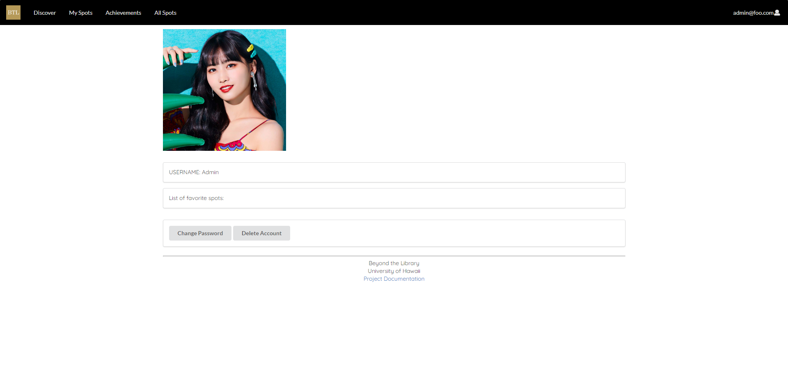

<a href='https://beyond-the-library.meteorapp.com'>
    
</a>


## Quick Access
* [Current Live Version of Beyond the Library](https://beyond-the-library.meteorapp.com)
* [Beyond the Library Organization Page](https://github.com/beyond-the-library)
* [Documentation Repository](https://github.com/beyond-the-library/beyond-the-library.github.io)
* [Code Repository](https://github.com/beyond-the-library/beyond-the-library)
* [Project Milestone 1](https://github.com/beyond-the-library/beyond-the-library/projects/3)
* [Project Milestone 2](https://github.com/beyond-the-library/beyond-the-library/projects/2)
* [Project Milestone 3](https://github.com/beyond-the-library/beyond-the-library/projects/2)

## Table of Contents
* [Overview](#overview)
* [User Guide](#user-guide)
* [Developer Guide](#developer-guide)
* [Team Members](#team-members)

## Overview

Beyond the Library is a web application for students to post and rate study spots throughout the UH Manoa campus and the surrounding areas so that other students become aware of possible study spots. This is to inform UH students that there are other locations beside the library to study (hence the name). Each entry will list hours, capabilities, capacity of the location, and accessibility to different types of students. In addition, there is a “real-time” feature, where students can login and provide time-stamped notifications about the current state of the study space.

## User Guide

The following are example snapshots of the pages in Beyond The Library.

### Landing Page


[I'm alive, click me to visit the page you see above!](http://beyond-the-library.meteorapp.com/#/)

The landing page is created with the idea that users shouldn't have to scroll too much around a page to figure out what
 the page/website is all about. We provide information about the site and how/why users should create an account.

### User Profile Page


[I'm alive, click me to visit the page you see above!](http://beyond-the-library.meteorapp.com/#/userprofile)

The User Profile page is meant to highlight the users favorite spots and allows an easy way to customize their account.

### Sign Up Page


[I'm alive, click me to visit the page you see above!](http://beyond-the-library.meteorapp.com/#/signup)

The sign up page allows people to register for an account.

### Sign In Page


[I'm alive, click me to visit the page you see above!](http://beyond-the-library.meteorapp.com/#/signin)

The sign in page allows users to log into their account. Certain features, such as adding a study spot requires the
 user to be logged in.

### My Study Spot Page


[I'm alive, click me to visit the page you see above!](http://beyond-the-library.meteorapp.com/#/myspots)


[I'm alive, click me to visit the page you see above!](http://beyond-the-library.meteorapp.com/#/admin)

Study spots submitted by the user will appear under the My Spots page. Users cannot directly publish a spot; the admin
 user can edit and publish spots on the admin All Spots page.

### Discover New Study Spots Page


[I'm alive, click me to visit the page you see above!](http://beyond-the-library.meteorapp.com/#/discovery)

Users can filter study spots based on various parameters such as major restriction. Rejected and archived spots will
 NOT be displayed on this page. Only the admin user has access to those study spots.
 
### Achievements Page
 
 
[I'm alive, click me to visit the page you see above!](http://beyond-the-library.meteorapp.com/#/achievements)

Users can earn achievements based on their activities such as adding a certain amount of study spots to their
 favorites. This encourages users to be active in Beyond The Library.
  
## Developer Guide

### Installation

1. Install <a href="https://www.meteor.com/install">Meteor</a>
2. Clone <a href="https://github.com/beyond-the-library/beyond-the-library">Beyond the Library</a> to your local machine
3. Navigate to the app/ directory in your local copy of Beyond the Library
4. Run the following commands to install the necessary libraries:
    ```
    meteor npm install
    ```
    ```
    npm i semantic-ui-carousel-react
    ```
5. Run the application with the following command:
    ```
    npm i semantic-ui-carousel-react
    ```
6. Running the app for the first time should produce a similar output:
    ```
   D:\User\Documents\GitHub\beyond-the-library\app>meteor npm run start
   
   > meteor-application-template-react@ start D:\User\Documents\GitHub\beyond-the-library\app
   > meteor --no-release-check --settings ../config/settings.development.json
   
   [[[[[ ~\D\User\Documents\GitHub\beyond-the-library\app ]]]]]
   
   => Started proxy.
   => Started MongoDB.
   W20191204-22:38:22.096(-10)? (STDERR) Note: you are using a pure-JavaScript implementation of bcrypt.
   W20191204-22:38:22.159(-10)? (STDERR) While this implementation will work correctly, it is known to be
   W20191204-22:38:22.159(-10)? (STDERR) approximately three times slower than the native implementation.
   W20191204-22:38:22.160(-10)? (STDERR) In order to use the native implementation instead, run
   W20191204-22:38:22.161(-10)? (STDERR) 
   W20191204-22:38:22.161(-10)? (STDERR)   meteor npm install --save bcrypt
   W20191204-22:38:22.162(-10)? (STDERR) 
   W20191204-22:38:22.163(-10)? (STDERR) in the root directory of your application.
   I20191204-22:38:22.595(-10)? Creating the default user(s)
   I20191204-22:38:22.596(-10)?   Creating user admin@foo.com.
   I20191204-22:38:22.917(-10)?   Creating user john@foo.com.
   I20191204-22:38:23.222(-10)?   Creating user aljtest@foo.com.
   I20191204-22:38:23.366(-10)? Creating default spots data.
   I20191204-22:38:23.368(-10)?   Adding: Paradise Palms (john@foo.com)
   I20191204-22:38:23.426(-10)?   Adding: Engineering POST Building (admin@foo.com)
   I20191204-22:38:23.429(-10)?   Adding: Rejected Spot (admin@foo.com)
   I20191204-22:38:23.432(-10)?   Adding: Archived Spot (admin@foo.com)
   I20191204-22:38:23.435(-10)?   Adding: Le Crepe Law School (john@foo.com)
   I20191204-22:38:23.438(-10)?   Adding: Marine Science Building (john@foo.com)
   I20191204-22:38:23.440(-10)?   Adding: Pacific Hurricane Center (john@foo.com)
   I20191204-22:38:23.443(-10)?   Adding: Queen Liliuokalani Center (john@foo.com)
   I20191204-22:38:23.445(-10)?   Adding: Saunders Hall (john@foo.com)
   I20191204-22:38:23.449(-10)?   Adding: Architecture (john@foo.com)
   I20191204-22:38:23.451(-10)?   Adding: Balle (john@foo.com)
   I20191204-22:38:23.454(-10)?   Adding: George Hall (john@foo.com)
   I20191204-22:38:23.457(-10)?   Adding: Kuykendall Hall (john@foo.com)
   => Started your app.
   
   => App running at: http://localhost:3000/
      Type Control-C twice to stop.

    ```

7. If the app was installed correctly, you will be able to view it at http://localhost:3000/. You can login using the credentials in <a href="https://github.com/beyond-the-library/beyond-the-library/blob/master/config/settings.development.json">settings.development.json</a>

## Team Members

* [Christopher's Professional Portfolio](https://chriswon98.github.io/)  
* [Yuhan's Professional Portfolio](https://yuhanj.github.io/)
* [Aljaed's Professional Portfolio](https://aljereno.github.io/)    
* [Andrew's Professional Portfolio](https://asalazar46.github.io/)  
